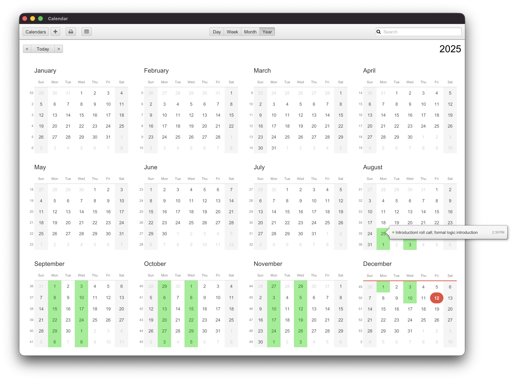
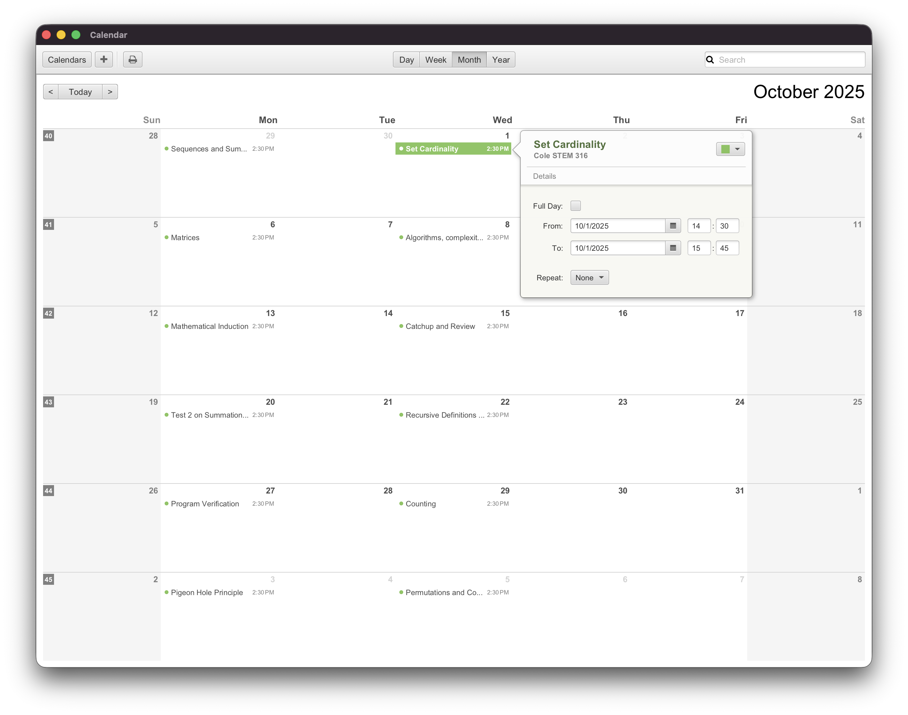
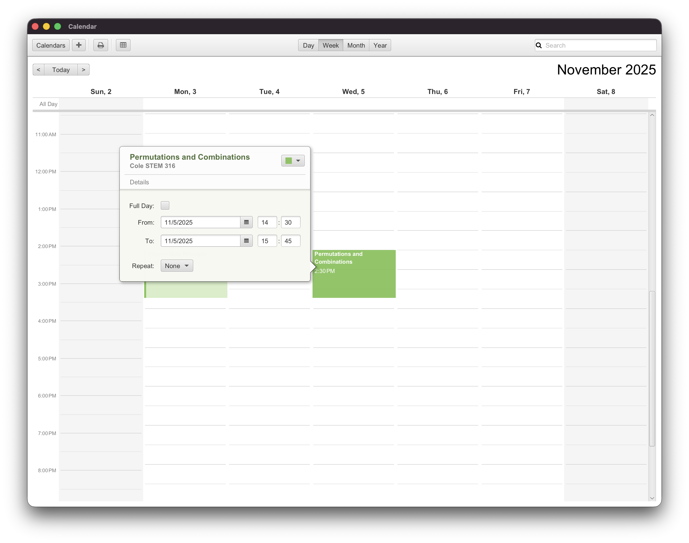
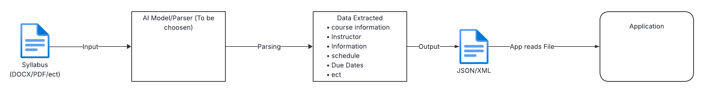

# Spring Proof of Concept

## Abstract

In higher education, students are required to manage large amounts of academic information distributed across multiple course syllabi. These syllabi vary widely in structure and file formats, making automated processes difficult. Recent advances in Artificial Intelligence (AI) and it's subsets natural language processing (NLP) and large language models (LLMs) have enabled more effective extraction of information from unstructured text. However, the lack of standardized syllabus formatting remains a major barrier to reliable academic data automation. The problem addressed in this study is the inability of existing systems to consistently extract and organize key academic information from syllabus documents. Here we show that a modular AI-driven processing pipeline can convert unstructured syllabi from multiple file types into a standardized, machine-readable academic format. Our pipeline integrates document parsing, language model analysis, and schema-based validation to extract critical elements such as grading policies, assignment weights, and calendar events. Compared to traditional manual entry and rigid rule-based systems, this approach adapts to diverse syllabus structures while maintaining consistency in data output. This model enables integration of academic information into calendar and productivity tools, improving accessibility for students. More broadly, this research demonstrates how artificial intelligence can support the formalization of unstructured academic data and enhance digital educational infrastructure.

## What is Spring?
Spring is an application that allows students to submit their course syllabi and automatically generates a calendar view tailored specifically to their academic schedule, displaying the most relevant information for each course. For example, when students use traditional planners, they must manually input important details such as class times, assignment due dates, and exam dates. Entering this information for just one course is already tedious, let alone for multiple courses. 

## Output and End Result

 

## Limitations with Similar Tools
While there are some tools like <a href = "https://www.syllabuddy.com">SyllaBuddy</a> that aim to help with this problem. When given an PDF that is unorgnizied like the following:  Syllabuddy struggles to accurately and effectively output correct data unless the syllabi is somewhat organized or a typical syllabi.

## The Spring Pipeline Concept Model
*This model is just a concept and subject to change!*

This is the simplest form of the Spring pipeline. The idea here is to parse the users input or in this case their syllabi into data the AI model can work with (text). Next the AI tokenizes the input and outputs a formated JSON/XML file that conforms to a JSON/XML Schema that represents how the output should be organized. We can use this to validate the output from the AI model and it also gives the chance to create a "Standard" for how we represent a course syllabi.

### The AI Parser
For this project, a dataset consisting of thousands of syllabi from *Stephen F. Austin State University* course catalog is to be used to train an AI model (to be decided). Initially, a rule-based engine was considered to parse the syllabi text directly, but it proved ineffective as the unorganization of syllabi is extremely high. Early Testing with some AI models found that small parameter and context window models such as *TinyLlama* did not have the capabilities of performing this task, or not without serious tradeoffs. Some AI Models did show promise, with some training or fine tuning on course datasets would ensure their accuracy and precision.

